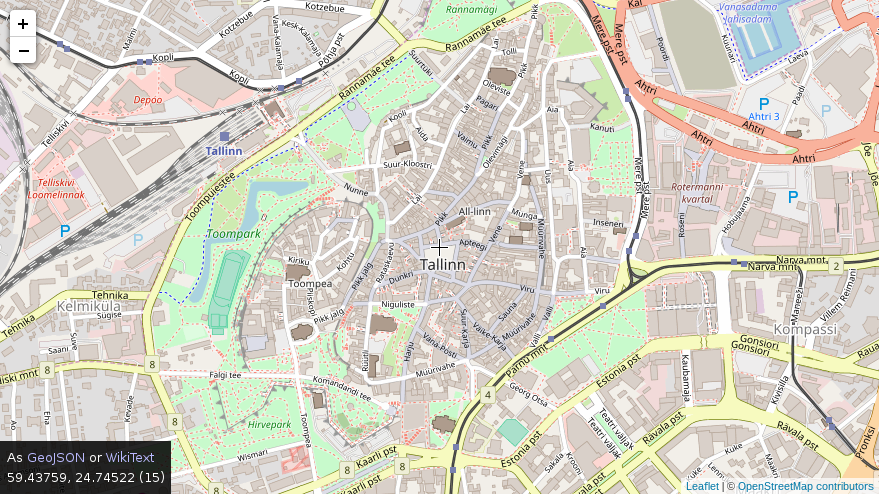

# Find latitude and longitude on a map

A utility for finding the latitude and longitude of a point on a map.
[Use it](https://mafford.com/util/get-lat-lng).

The coordinates displayed are those of the exact centre of the map, as shown by
the crosshair. It's possible to get the current coordinate expressed as
[GeoJSON](https://geojson.org) or
[Wikitext](https://en.wikipedia.org/wiki/Wikipedia:How_to_add_geocodes_to_articles)
by clicking on the blue links above the latitude and longitude.

Utilities like this already exist but most seem to use Google Maps. This is an
equivalent using [OpenStreetMap](https://www.openstreetmap.org).

## Install

The contents of the `src` folder are standalone but it does require
[leaflet.js](https://leafletjs.com) to also be placed there.
[Download a copy](https://cdn.leafletjs.com/leaflet/v1.2.0/leaflet.zip) and
extract the `leaflet` folder into the `src` folder. This has been tested with
leaflet 1.2.0 but should work with later versions, assuming no breaking
changes.

## Licence

Licensed under the [MIT Licence](https://opensource.org/licenses/MIT):

Copyright &copy; 2018 [Martyn Afford](https://mafford.com)

Permission is hereby granted, free of charge, to any person obtaining a copy of
this software and associated documentation files (the "Software"), to deal in
the Software without restriction, including without limitation the rights to
use, copy, modify, merge, publish, distribute, sublicense, and/or sell copies of
the Software, and to permit persons to whom the Software is furnished to do so,
subject to the following conditions:

The above copyright notice and this permission notice shall be included in all
copies or substantial portions of the Software.

THE SOFTWARE IS PROVIDED "AS IS", WITHOUT WARRANTY OF ANY KIND, EXPRESS OR
IMPLIED, INCLUDING BUT NOT LIMITED TO THE WARRANTIES OF MERCHANTABILITY,
FITNESS FOR A PARTICULAR PURPOSE AND NONINFRINGEMENT. IN NO EVENT SHALL THE
AUTHORS OR COPYRIGHT HOLDERS BE LIABLE FOR ANY CLAIM, DAMAGES OR OTHER
LIABILITY, WHETHER IN AN ACTION OF CONTRACT, TORT OR OTHERWISE, ARISING FROM,
OUT OF OR IN CONNECTION WITH THE SOFTWARE OR THE USE OR OTHER DEALINGS IN THE
SOFTWARE.
